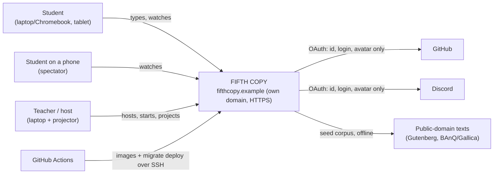
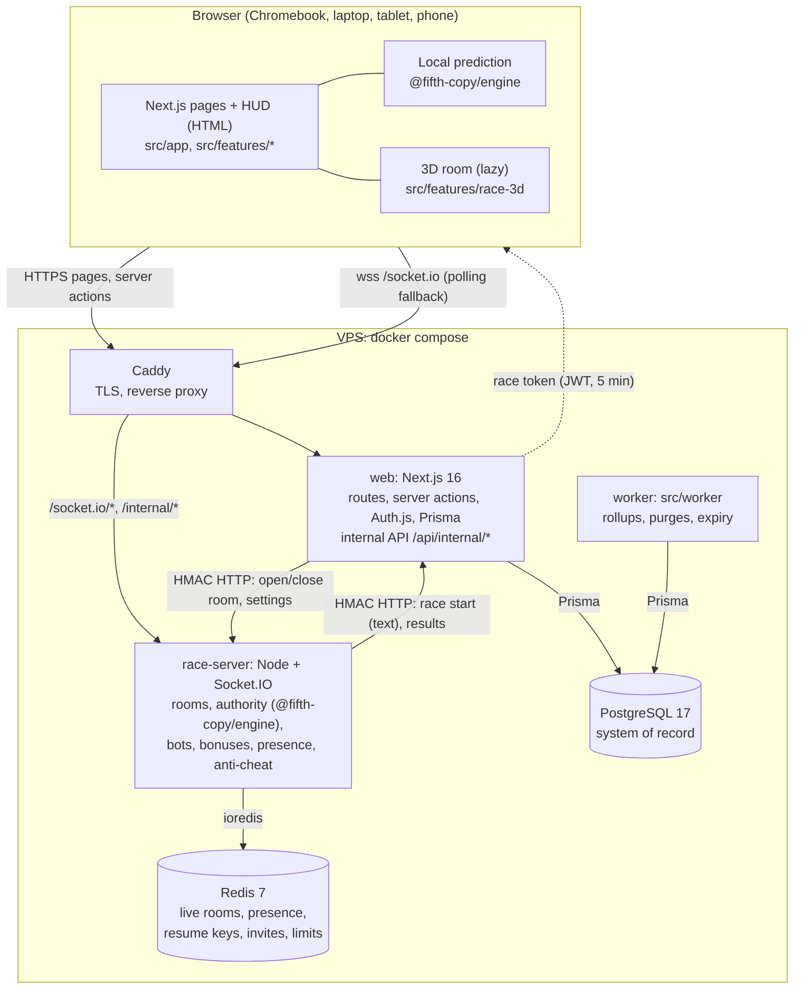
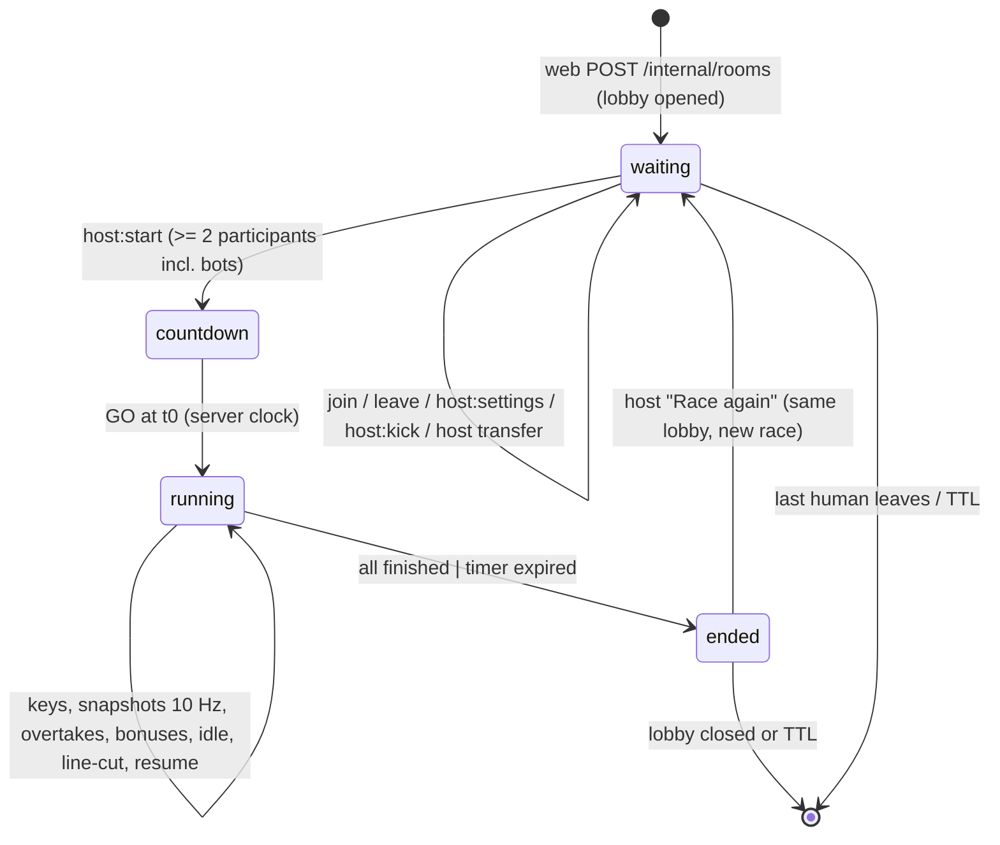
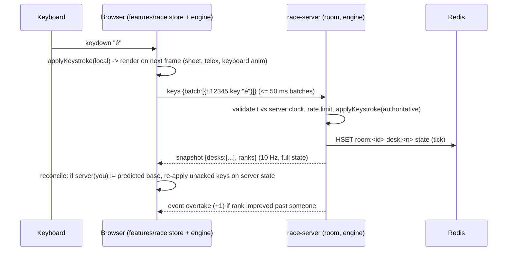
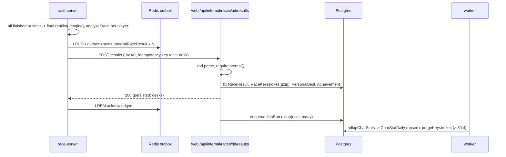
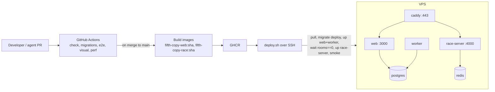

# FIFTH COPY: target architecture (A to Z)

Status: proposed 2026-10-02, pending human acceptance of ADRs 0005-0013. Source of truth for *what* to build: `docs/spec/fifth-copy-spec.md` (v1.0) ; *how it looks* (every design decision): `docs/design/bible/FIFTH_COPY_DESIGN_BIBLE.md`. This document says *how* the system is shaped, why this shape beat the alternatives, and where every piece lives. Decisions are recorded as ADRs in `docs/adr/`; this page links them and never contradicts them.

How to read it: sections 1-2 are the reasoning (read once). Sections 3-11 are the reference an agent consults for the container it touches (`adr-governing <path>` names the ADR; the ADR names the section). Section 12 maps it to the GitHub board.

---

## 1. Context and forces

| Force | Source | What it imposes |
|---|---|---|
| 30+ students race live in one room; 60 tested, 100 supported | spec 1, 5.2, 16.2 (R3, R63) | long-lived connections, one authoritative clock, 10 Hz fan-out to 100 clients |
| Server-authoritative keystrokes, anti-cheat | spec 16.2, 16.3 (R198, R202) | the server validates every key; the browser cannot be trusted |
| Instant typing feedback on school Chromebooks and Wi-Fi | spec 7.3, 16.2 (R99, R102) | local rendering on key-down, HTML text, reconciliation with the server |
| School networks may block WebSocket upgrades | cards #442, #443 | polling fallback |
| Required stack: Next.js App Router + TS, Tailwind, PostgreSQL, Prisma (ADR 0002), three.js, Auth.js, separate Node real-time server, Redis | spec 16.1, 16.2 | fixed choices; architecture decides how they fit together |
| Minors, no email, Law 25 | spec 12 (R152, R165) | minimal data, guest identity, deletion, retention, no third-party data flows |
| Own domain, HTTPS, CI/CD on merge, no deploy may kill a live class race | spec 16.5, board critic | one VPS, reverse proxy, draining |
| Built by agents one small card at a time (<= ~400 changed lines), fresh context each | `AGENTS.md`, `agents/PROTOCOL.md` | boundaries must be machine-checked; every container has a README, an ADR and a verify command |
| Lots of statistics, fast profile pages | spec 13 (R168-R183) | raw keystrokes rolled up into daily per-character stats |

Quality attributes with numbers: 10 Hz snapshots; <= 50 ms keystroke batching; 60 fps mid laptop / 30 fps Chromebook; <= 60 draw calls; race started in < 60 s from landing; 100 players per room; 30-day raw keystroke retention; 2-minute reconnection grace; 60-second idle kick.

## 2. Architectures considered

The problem has ten independent decisions. For each, the options were scored against: **F** fits the required stack and spec, **R** real-time needs (100 players, authority, instant feedback, school networks), **A** agent-kit fit (small cards, enforceable boundaries, fresh-context readability), **O** operational simplicity for a student team on one VPS, **T** testability. Scale 1-5; the chosen option is bold.

### 2.1 Process topology
| Option | F | R | A | O | T | Verdict |
|---|---|---|---|---|---|---|
| Next.js only, Socket.IO inside a custom server | 2 | 3 | 2 | 4 | 3 | Spec forbids; custom server disables standalone output and couples web deploys to live races |
| **Modular monolith web + one real-time service + worker entry point** | 5 | 5 | 5 | 4 | 5 | Minimum number of processes that satisfies the spec; each has one reason to exist |
| Microservices (auth, lobby, race, stats, texts) | 3 | 4 | 2 | 1 | 3 | Five deploys and network calls for a one-school app; cards would span services |
| Serverless web + managed real-time (Ably, PartyKit, Durable Objects) | 1 | 3 | 3 | 3 | 2 | Authority logic still needs compute; data leaves our domain; spec requires own hosting |
| Full event-sourced/CQRS race | 3 | 4 | 2 | 2 | 4 | Keystrokes are an event log already; the rest of CQRS is ceremony here. We keep the idea (append-only keystrokes, snapshots) without the framework |

### 2.2 Web app internal structure
| Option | Verdict |
|---|---|
| **Feature-sliced modular monolith** (`src/features/<f>/{components,actions,queries,jobs,schema.ts,index.ts}`, ADR 0001) | Already in place and enforced; one card = one feature slice; cross-feature only via `index.ts` |
| Layered (controllers/services/repositories) | Spreads one card across four folders; cross-cutting imports are hard to lint |
| DDD bounded contexts as separate packages | Right idea, too much structure for ~10 features; the feature folders are the contexts |

### 2.3 Real-time framework
| Option | Verdict |
|---|---|
| **Socket.IO 4** | Rooms, acks, reconnection, long-polling fallback, Redis adapter; bots join through the same server code |
| Colyseus | Room and state sync built in, but binary schema sync fights per-player text overlays and HTML text; no polling fallback; its matchmaker duplicates our Postgres lobby |
| Raw `ws` | We would rewrite rooms, acks, reconnection, fallback |
| SSE down + HTTP up | Works through any proxy, but 100 players posting keystrokes every 50 ms is 2000 HTTP requests/s |

### 2.4 Authority and feedback model
| Option | Verdict |
|---|---|
| **Server authority + client prediction with a shared deterministic engine** (ADR 0007) | Instant feedback, one implementation of the rules, cheat-resistant, replayable |
| Server authority only | 100 ms+ visible lag per key on school Wi-Fi |
| Client authority with server audit | Trivially cheated; spec forbids |

### 2.5 Live state vs durable data
| Option | Verdict |
|---|---|
| **Redis for live rooms (TTL), Postgres as the only system of record, written by the web app through an internal API** (ADR 0008) | Race server stays database-less; one validated write path; outbox survives restarts |
| Race server writes Postgres with its own Prisma client | Two processes share the schema and migrations; validation in two places |
| Postgres for live state | Wrong tool at 10 Hz x 100 players |

### 2.6 Sharing code between browser, web server and race server
| Option | Verdict |
|---|---|
| **npm workspaces, packages ship TS source** (ADR 0005) | No build step for dev or tests; boundaries lintable; atomic cards across both sides |
| Copy the engine into both | Drift within weeks |
| Publish a package | Release ceremony for every rule change |

### 2.7 Background jobs
| Option | Verdict |
|---|---|
| **Worker entry point of the web package, advisory-lock scheduler, `JobRun` table** (ADR 0011) | No new infra, no foreign schema, same Prisma and features |
| BullMQ on Redis | Redis is ephemeral here; losing it would lose scheduled work |
| pg-boss | Good upgrade path; owns a schema and a pool for four jobs |
| Cron inside the race server | Mixes a stateless real-time process with database work |

### 2.8 Hosting
| Option | Verdict |
|---|---|
| **One VPS, Docker Compose, Caddy, CI-built images, deploy-when-idle for the race server** (ADR 0012) | Smallest operable production that meets HTTPS, own domain, CD and "never kill a live race" |
| Vercel web + VPS sockets | Two hosts, cross-origin cookies, data on a third party |
| Kubernetes | Too much surface |
| Bare `pm2` on the VPS | No image immutability, harder rollback |

### 2.9 Identity
| Option | Verdict |
|---|---|
| **Auth.js v5, JWT sessions, signed guest cookie, no email, race tokens minted by web** (ADR 0009) | Required library; guests without accounts tables; the race server trusts one short-lived token |
| Database sessions | A query per request; revocation handled by `tokenVersion` instead |
| Custom auth | Spec names Auth.js |

### 2.10 UI internationalisation
| Option | Verdict |
|---|---|
| **Cookie locale, typed catalogs, no URL prefix** (ADR 0010) | Room links stay language-neutral; missing keys fail type-check |
| `/fr` `/en` routes with next-intl | Nothing to index publicly; prefixes complicate codes and invites |

### 2.11 The composite
The chosen architecture stitches the bold rows together:

> **A feature-sliced Next.js modular monolith** (web + worker entry points) that owns identity, lobbies, texts, results, statistics and all persistence, **plus one server-authoritative Socket.IO race service** that owns live rooms in Redis, **both running the same pure race engine** from a shared workspace package and speaking a **single zod-declared protocol**, deployed as **Docker Compose behind Caddy on one VPS** with CI-built images and race-server draining.

It is the best fit because every force in section 1 maps to exactly one mechanism, no mechanism exists without a force, and each container can be built and verified by an agent in isolation: the engine by unit tests, the race server by bot rooms, the web app by Playwright, the deploy by the smoke script.

## 3. The system in two pictures

### 3.1 Context


### 3.2 Containers


Shared packages (`@fifth-copy/engine`, `@fifth-copy/protocol`) are compiled into `web`, `race-server` and the browser bundle; they are not processes.

## 4. Containers and responsibilities

| Container | Runtime | Owns | Never does |
|---|---|---|---|
| **web** (root package) | Next.js 16, Node 24 | routes, layouts, server actions, route handlers, Auth.js, guest identity, lobby records, invites, text generation, race records, result persistence, statistics queries, profile, settings, privacy, i18n, theming, HUD and 3D client code, race-token minting, internal API for the race server | hold sockets; compute race state during a race |
| **race-server** (`services/race-server`) | Node 24, Socket.IO, ioredis | live rooms and membership, host powers at runtime, countdown and clock, keystroke validation through the engine, 10 Hz snapshots, overtakes, bonuses, idle and grace timers, bots, anti-cheat flags, spectator channel, result outbox | touch Postgres or Prisma; read session cookies; generate texts; decide persistence rules |
| **worker** (`src/worker`) | Node 24 (web image) | daily char-stat rollup, keystroke purge, lobby expiry, guest retention, deletion follow-ups | serve HTTP; hold sockets |
| **postgres** | PostgreSQL 17 | all durable data (`prisma/schema/*.prisma`) | live state |
| **redis** | Redis 7, no persistence | rooms, presence, resume keys, invite tokens, rate limits, result outbox; every key has a TTL | anything that must survive a restart |
| **caddy** | Caddy 2 | TLS (Let's Encrypt), routing, WebSocket upgrade | auth, CSP (web sets headers) |
| `@fifth-copy/engine` | pure TS | race rules (ADR 0007) | IO, clocks, randomness |
| `@fifth-copy/protocol` | zod | wire shapes, race settings schema, token claims, versions | logic |

## 5. Repository map and boundaries

```
.                                  root = web app (Next.js), npm workspace root
├── src/
│   ├── app/                       routes only; compose features; (auth), lobby/[code], race/[id], results/[id], profile, settings, guide, privacy, api/
│   │   └── api/internal/          HMAC-verified routes called by the race server (races, results, host transfer)
│   ├── features/
│   │   ├── identity/              guest cookie, credentials, OAuth, recovery code, merge, avatars, preferences
│   │   ├── lobby/                 create/join/code/invites/settings/host record, race-token minting, room open/close calls
│   │   ├── texts/                 corpus, import, generator (sentences, words, drills), profanity filter
│   │   ├── race/                  "use client" leaves: socket client, race store, prediction, HUD, spectator views
│   │   ├── race-3d/               "use client" leaf: three.js scene, cameras, quality presets (lazy chunk)
│   │   ├── results/               internal results write path, achievements, bests, Dawn report queries + screen
│   │   ├── stats/                 Personnel file queries, heatmap mapping, rollup + purge jobs, callouts
│   │   ├── guide/                 special-characters guide
│   │   └── health/                liveness
│   ├── components/ui/             design-system primitives (tokens only, no feature imports)
│   ├── server/                    db client, auth (getViewer, requireHost), internal-api signing, limiter, logger
│   ├── worker/                    main.ts scheduler + job registry (ADR 0011)
│   ├── i18n/                      fr.ts, en.ts catalogs, getT/useT (ADR 0010)
│   ├── lib/                       pure utilities (cn, time: America/Toronto)
│   ├── env.ts                     the only process.env reader of the web app
│   └── proxy.ts                   locale cookie default, optimistic redirects only
├── packages/
│   ├── engine/                    @fifth-copy/engine (ADR 0007)
│   └── protocol/                  @fifth-copy/protocol (ADR 0006)
├── services/
│   └── race-server/               @fifth-copy/race-server (ADR 0006, 0008): main, env, http/, socket/, rooms/, players/, bots/, redis/, persist/
├── prisma/schema/                 identity, lobby, race, texts, stats, jobs (.prisma, one per feature)
├── deploy/                        docker-compose.prod.yml, Caddyfile, deploy.sh (ADR 0012)
├── e2e/                           Playwright: functional, a11y, visual, perf/, multi-context race specs
├── docs/{spec,adr,design,architecture}/   what, decisions, tokens, how
└── scripts/, agents/, work/       kit
```

Boundary rules (all enforced by `scripts/check.sh`: dependency-cruiser over `src packages services`, ESLint):
- `app -> features -> server/lib`; a feature imports another only through its `index.ts`; `components/ui` imports no features or server code.
- Prisma client only in `src/server/**`, `src/features/*/{queries,actions,jobs}/**` and `src/worker/**`.
- `packages/engine` imports nothing outside itself. `packages/protocol` imports only zod and the engine.
- `services/race-server` never imports `src/`, Next, React or Prisma. `src/` never imports `services/`. Workspace packages are imported by name (`@fifth-copy/engine`), never by path.
- `process.env` only in `src/env.ts` and `services/race-server/src/env.ts`.

## 6. The shared engine (`@fifth-copy/engine`)

Pure functions over plain data; the full contract is in `packages/engine/README.md` and ADR 0007. Public surface (lands one card at a time; names are the contract):

| Module | Functions | Spec |
|---|---|---|
| `text` | `normalizeTypeable(s)` (NFC, typeable whitelist), `effectiveText(base, overlay)`, `wordCount` | 4.1, 10, R164 |
| `reducers` | `applyKeystroke(state, key, text, settings)` composed from `continueMode`, `blockMode`, `backspace` | 4.3 |
| `scoring` | `wpm`, `rawWpm`, `accuracy`, `progress`, `cleanAndAdjustedWpm` | 4.2, 10 |
| `ranking` | `compareResults(a, b)` | 4.1 rule 6, 4.4, 4.5, 7.4 |
| `bonus` | `eligibleBonus(rankPct)`, `applyBonus(room, from, to)`, cooldown and repeat-immunity checks | 10 |
| `bots` | `botProfile(level)`, `nextBotKeystroke(profile, ctx, rng)` | 9 |
| `anticheat` | `analyseTrace(keys, text) -> Flag[]` | 16.3 |

Invariants tested by property tests: normalisation is idempotent; progress never decreases except by backspace; the comparator is a strict total order; replaying a trace through the reducer reproduces the stored final state; bots never produce a constant inter-key delay.

## 7. Real-time design (race-server + `features/race`)

### 7.1 Room lifecycle


Player states inside `running`: `typing -> finished`, `typing -> abandoned` (button), `typing -> asleep` (no key 60 s while connected; warning at 45 s), `typing -> line-cut` (socket lost; grace 2 min) `-> typing` (resume with the same desk and progress) or `-> expired`.

### 7.2 Protocol (`@fifth-copy/protocol`)
Client -> server: `join {token}`, `keys {batch: Keystroke[]}` (<= 50 ms of keys, `t` relative to GO), `abandon`, `host:start`, `host:kick {desk}`, `host:settings {patch}` (also persisted by web), `ping {sent}`.
Server -> client: `welcome {room, you: desk, text, overlay, settings, t0, serverNow}`, `snapshot {t, desks: [desk, cursor, correct, errors, status][], ranks}` at 10 Hz, `event {kind: overtake|passed|new-host|line-cut|resumed|asleep|bonus-sent|bonus-hit|kicked, ...}`, `countdown {goAt}`, `ended {raceId, ranking}`, `rejected {reason}`.
Internal HTTP (HMAC): see ADR 0006 point 6. All payloads carry `v: PROTOCOL_VERSION`.

### 7.3 One keystroke, end to end

Clock: `welcome` carries `serverNow`; the client keeps an offset from `ping/pong` (card #172); keystroke `t` outside `[serverElapsed - 2 s, serverElapsed + 0.2 s]` is clamped and counted as a timing anomaly.

### 7.4 Presence, reconnection, idle (spec 4.5, 7.4)
Disconnect -> `line-cut`, desk keeps progress, Redis `resume:<key>` (2 min TTL) maps to (room, desk). Socket.IO reconnects with the same race token plus `resumeKey`; the server restores the desk and sends a fresh `welcome`. Grace expiry -> `expired`, ranked by progress at disconnect. Idle is decided only while connected (socket state decides, R57). The race clock never pauses.

### 7.5 Bots (spec 9)
A bot is a server-side participant with a desk, a `botProfile` and a scheduler that asks the engine for its next keystroke and feeds it through the same `keys` path as humans. Levels Recruit 20 / Clerk 35 / Officer 50 / Commissar 70 / Major 90+. Bots fill Quick-race seats, provide the minimum of two, and drive load tests (`scripts/load-test.ts` opens a room with N bots).

### 7.6 Catch-up bonuses (spec 10)
Each tick the server computes rank percentiles, awards at most one bonus card per player by position (bottom 50% Extra Paperwork, 33% Exemption, 25% Smoke Break), enforces cooldowns and repeat immunity, and applies effects as text **overlays** (never edits to the base text) or a timed `blur` flag in the target's snapshot. Clean and adjusted WPM are both recorded (ADR 0007). Bots receive and send bonuses like humans (to be confirmed with the teacher, open question 14).

### 7.7 Anti-cheat (spec 16.3)
Client: paste blocked, text rendered as individual spans with `user-select: none`. Server: `analyseTrace` per player at race end plus live checks (sustained WPM cap, batch size, timing anomalies). Flags set `suspicious = true` on the result; such results show on the podium with a "under review" docket but are excluded from stats, bests and callouts.

### 7.8 Spectators (spec 6.4, 3.5)
Projector and phones join the room on the `spectator` channel with a `role: spectator` token (no desk, no `keys`). They receive snapshots and events; the projector view uses the overview camera; phones get the HUD in spectator mode and never mount the typing surface (R36, card #293).

### 7.9 Capacity
100 players x 20 keys/s worst case = 2000 keystrokes/s in <= 50 ms batches = <= 2000 small messages/s in; 10 snapshots/s x 100 clients x ~1.5 kB = 1.5 MB/s out. One Node process on a 2-vCPU VPS handles this with headroom; the engine step is microseconds. Beyond that: Socket.IO Redis adapter plus room-sticky routing (additive, no protocol change).

## 8. Web app design

### 8.1 Routes (`src/app`)
`/` landing (Quick race, Create private race, Join with code) · `/(auth)/sign-in`, `/sign-up`, `/recover` · `/lobby/[code]` · `/invite/[token]` · `/race/[raceId]` (seat view; `?view=projector` overview; phones forced to spectator) · `/results/[raceId]` Dawn report · `/profile` Personnel file · `/settings` · `/guide` special characters · `/privacy` · `/design` · `/api/health` · `/api/internal/*` (HMAC) · `/api/avatars/[userId]` (lobby-scoped).

### 8.2 Features and their public API (`index.ts`)
- `identity`: `getViewer`, `requireViewer`, `ensureGuest`, `signUp`, `signIn`, `signOut`, `redeemRecoveryCode`, `mergeGuestInto`, `updatePreferences`, `uploadAvatar`, `deleteMyData`.
- `lobby`: `createLobby`, `joinByCode`, `consumeInvite`, `createInvite`, `updateSettings` (host only), `mintRaceToken`, `openRoom`/`closeRoom` (internal calls), `recordHostTransfer`.
- `texts`: `generateRaceText(settings)` (exact word count, accents, practice letters, numbers/symbols/punctuation, difficulty), `importCorpus`, `isClean(text)`.
- `race` (client): `RaceClient`, `useRaceStore`, HUD components (telex, sheet, keyboard, nixie counters, race card, stamps, sabotage tray, abandon), spectator views.
- `race-3d` (client, lazy): `RaceScene`, `OverviewScene`, `benchmarkGpu`.
- `results`: internal `persistRaceResults`, `getDawnReport(raceId, viewer)`, podium/ranking/personal card components.
- `stats`: `getProfile`, `getSeries`, `getHeatmap(layout)`, `getBests`, `getCallouts`, jobs `rollupCharStats`, `purgeKeystrokes`.
- `guide`: static content per layout and OS.

### 8.3 Rendering and data rules
Server Components by default; `"use client"` only on leaves (race HUD, 3D, forms with local state, toggles). Mutations are server actions or route handlers with zod validation and authorization inside (`requireViewer`, `requireHost`). Pages read the viewer and locale cookies, so they render per request; cache below the component with `"use cache"` only for viewer-independent data (text corpus lists, the guide). The race page renders the HUD shell on the server, then the client connects to the race server with a token fetched through a server action.

### 8.4 Identity, i18n, theme
ADR 0009, ADR 0010. Theme: `data-theme` on `<html>` from the preference cookie, tokens in `docs/design/tokens.css` (brand tokens arrive with epic #10). Keyboard layout preference drives the heatmap mapping (R179, R180).

## 9. Data

### 9.1 Ownership
See the table in ADR 0008. In one sentence: Postgres is the only system of record and only the web app writes it; Redis holds live state with TTLs; raw keystrokes live 30 days and are rolled up daily into `CharStatDaily`; the day boundary is America/Toronto.

### 9.2 Schema files (`prisma/schema/`)
`identity.prisma` (User, OAuthAccount, RecoveryCode, Preference) · `lobby.prisma` (Lobby, Invite) · `race.prisma` (Race with text snapshot and settings, RaceResult, RaceKeystrokes blob) · `texts.prisma` (Text with language, type, source, licence) · `stats.prisma` (CharStatDaily, PersonalBest, Achievement) · `jobs.prisma` (JobRun). Field lists live only there (`AGENTS.md`). The first `touches:prisma` card creates the initial migration; later cards are additive (expand, migrate, contract across cards for breaking changes).

### 9.3 Race end, persistence, statistics


### 9.4 Privacy (Law 25)
Data inventory and retention live in `docs/privacy/` (cards #71-#85): user (name, hashed password, provider id, avatar), race results, keystrokes (30 d), daily stats, preferences. `deleteMyData` removes all of it in one transaction plus avatar files and enqueues a job that confirms backups beyond the retention window are purged. No email, no chat, avatars visible only within a lobby.

## 10. Cross-cutting

**Security.** Threats and controls: forged race joins (signed 5-minute tokens, role claims); replayed internal calls (HMAC with timestamp and nonce, idempotency keys); socket floods (per-socket rate limits, payload caps, Redis-backed limiter shared with web); password guessing (Argon2id, throttling); XSS (no `dangerouslySetInnerHTML`, strict CSP from `next.config.ts`); CSRF (server actions origin check, SameSite cookies); secrets (env only, redacted logs, never in issues or PRs).

**Observability.** Both processes log JSON through `pino` with redaction; `/api/health` and `/health` (rooms, draining, versions); request ids propagate from web to race server on internal calls. Error reporting tool: later ADR (card #419).

**Performance budgets.** ADR 0013: first-load JS of the race route without 3D <= 250 kB gzip; `three` only in the race-3d chunk; >= 30 fps median at Low preset with 60 bots in CI; <= 60 draw calls; landing-to-race < 60 s. Server: snapshot serialisation < 2 ms for 100 desks (unit benchmark).

**Accessibility.** Primitives are real elements with visible focus; race state changes are announced through a polite live region (card #242); reduced-motion and flash-safety rules apply to stamps and the bulb (card #28); colour-blind-safe rival markers (R80).

**Testing strategy.**
| Level | Where | What |
|---|---|---|
| Unit | `packages/*/src/**/*.test.ts`, `src/**/*.test.ts`, `services/race-server/src/**/*.test.ts` | engine tables and properties, protocol schemas, room state machine with a fake clock, scheduler |
| Integration | `services/race-server` with `socket.io-client` and real Redis (CI service) | join, start, keys, snapshots, reconnection, idle, bots, outbox retry |
| Web integration | Vitest + test DB | server actions, internal routes (HMAC), queries, jobs |
| E2E | `e2e/` Playwright, multi-context, fast clock mode (`RACE_FAST_CLOCK=1` shortens idle, grace and countdown) | the ten scenarios of spec 16.6; a11y on every screen; visual baselines in the pinned image |
| Perf | `e2e/perf/` | bundle, fps, draw calls, time-to-race |
| Load | `scripts/load-test.ts` | 60 and 100 bots in one room, snapshot latency percentiles |

## 11. Delivery

### 11.1 Deployment

Environments: local (`npm run dev`, `npm run dev:race`, compose Postgres + Redis), CI (service containers), production (one VPS). A preview/staging host is optional and uses the same compose file with another `.env`.

### 11.2 Environment variables (names only)
| Name | Process | Purpose |
|---|---|---|
| `DATABASE_URL`, `TEST_DATABASE_URL` | web, worker | Postgres (ADR 0002, 0003) |
| `REDIS_URL` | race-server | live state |
| `RACE_SERVER_PORT` | race-server | listen port |
| `NEXT_PUBLIC_RACE_SERVER_URL` | browser | socket origin (same host in production, through Caddy) |
| `RACE_SERVER_INTERNAL_URL` | web | internal API base |
| `RACE_TOKEN_SECRET` | web, race-server | race tokens and internal HMAC |
| `AUTH_SECRET`, `AUTH_GITHUB_ID/SECRET`, `AUTH_DISCORD_ID/SECRET` | web | Auth.js |
| `NEXT_PUBLIC_APP_URL` | web | absolute links |

### 11.3 Versioning
Semver tags `vX.Y.Z` with a changelog (card #417); `PROTOCOL_VERSION` and `ENGINE_VERSION` are independent integers/semvers bumped by the card that changes them.

## 12. Build order and board mapping

What exists on `main` today: the Foundations epic (#2) and this architecture's skeleton: workspaces, `packages/engine`, `packages/protocol`, `services/race-server` (health endpoint, env, build, tests), Redis in compose, boundary and lint rules, ADRs 0005-0013 (proposed).

ADR cards on the board answered by these ADRs (the Analyst links them and removes `needs-replan` where the ADR is the deliverable): #149 -> 0006, #150 and #151 -> 0008, #30 -> 0009, #371 -> 0010, #313 and #339 -> 0011 and 0008, #402 -> 0012, #253 and #424 -> 0013, #198 -> 0007, #360 -> "no offline mode; bots are server-side" (0006, 0007). Still open as their own ADRs: #59 avatar storage, #142 host races or spectates (product), #338 leaderboards (product), #419 error reporting.

Suggested order for Iteration 1 technical cards, by dependency:
1. Identity data model and guest cookie (#31-#35) and the first migration (`touches:prisma`).
2. Race settings schema in `@fifth-copy/protocol` (#102), lobby model and create action (#96, #101, #103, #104), room code (#117-#119).
3. Engine reducers and scoring (#157-#164) with table-driven tests.
4. Race server: Socket.IO handshake with race tokens (#165), room registry and state machine (#166-#168), presence (#179), Redis (#155), desk allocator (#156).
5. Lobby screen with live player list (#105-#109) and i18n catalogs (#372, #373).
6. Keystroke ingestion and snapshots (#173-#176), race route and HUD (#210-#217), countdown (#169, #214).
7. Results persistence through the internal API (#188, #189), Dawn report (#298).
8. Hosting (#402-#413) once the teacher names the domain.

## 13. Risks and open decisions

| Risk | Mitigation | Owner |
|---|---|---|
| Auth.js adapter assumes an `email` column | Verify in card #38; custom adapter wrapper if needed (ADR 0009 consequence) | builder of #38 |
| School network blocks WebSocket | Socket.IO polling fallback on; card #443 verifies on a real school network | #442, #443 |
| Deploy waits for an idle race server during a class | Deploy-when-idle with a 60-minute cap; blue/green is the upgrade path (ADR 0012) | #412 |
| Text-changing bonuses vs fairness | Overlay model and clean/adjusted WPM (ADR 0007); teacher confirms values (open question 14) | #198, #445 |
| Chromebook 3D performance | Quality presets, LODs, HTML text, 2D fallback, CI fps gate (ADR 0013) | #273-#279 |
| Redis loss during a race | Rooms void, nothing durable lost (ADR 0008); Redis is local to the VPS | #204-#206 |
| Hosting provider unknown | Compose runs on any Docker host; decide with the teacher (Q4) | #445 |

## 14. Glossary
**Room**: the live, in-memory and Redis representation of a lobby on the race server. **Lobby**: the durable record (code, host, settings). **Desk**: a player's seat number and identity in a room (humans and bots). **Snapshot**: the full 10 Hz state message. **Overlay**: per-player text modifications caused by bonuses. **Race token**: short-lived JWT minted by web, verified by the race server. **Outbox**: Redis list of results awaiting acknowledgement by the web app. **Drain**: the race server refusing new rooms while live ones finish. **Rollup**: the daily aggregation of raw keystrokes into per-character stats.
