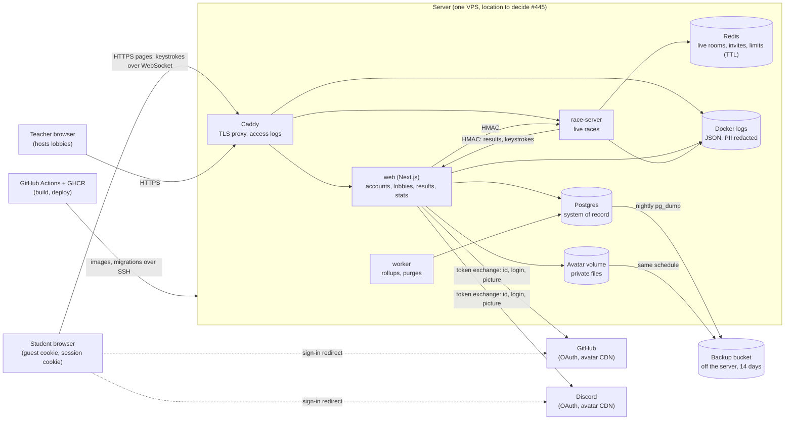

# Privacy impact assessment

Law 25 s. 3.3 asks for a privacy impact assessment (PIA) of any project that involves personal information. This is
the PIA of Fifth Copy, a typing race game for students aged 12 to 17. Card #71 (epic #29), replacing #74.
Requirements: R1, R152, R164, R165, R205. Index: [README](README.md).

The project wrote this assessment itself. It describes how the system is designed and where the project sees risk; it
does not say the project is compliant, and it is not legal advice. The open points for a qualified person are in
[Needs qualified review](#needs-qualified-review).

## Scope

- **In scope:** the Fifth Copy web app, race server, worker, their databases, logs and backups, the avatar files, the
  GitHub and Discord sign-in, and the deployment pipeline, as designed in `docs/architecture/ARCHITECTURE.md` and
  ADRs 0006 to 0014. Users: students (12 to 17) and teachers who host races, in class and at home.
- **Out of scope:** the school's own systems and the channel the school uses to send the parent letter
  ([consent.md](consent.md)); the student's device and browser; GitHub's and Discord's own processing of their users.
- **What is collected:** [inventory.md](inventory.md). **How long:** [retention.md](retention.md). **Consent
  position:** [consent.md](consent.md). **Person in charge:** [responsible.md](responsible.md).

## Data flows

| Flow | From -> to | Personal information | Protection | Source |
|---|---|---|---|---|
| Pages and actions | Browser -> Caddy -> web | Cookies (guest id or session), form input (username, password, settings), IP address | HTTPS, httpOnly SameSite cookies, input validated with zod | ADR 0009, ARCHITECTURE 10 |
| Live race | Browser -> Caddy -> race-server | Race token, keystrokes and timings, typist name, desk | HTTPS/WSS, 5-minute signed race tokens, rate limits | ADR 0006, ADR 0009 |
| Race results | race-server -> web | Results and compressed keystrokes per player | HMAC with timestamp and nonce, idempotency keys | ADR 0008 |
| Storage | web, worker -> Postgres | Every row of the [inventory](inventory.md) | Only the web app and worker write; private compose network | ADR 0002, ADR 0008, ADR 0011 |
| Live state | race-server -> Redis | Room members, progress, invites, rate-limit counters | Private network, every key has a TTL | ADR 0008 |
| Avatar files | web -> avatar volume | Uploaded or imported pictures | Re-encoded, metadata stripped, served only to lobby members (and seen by the operator when held or reported, to check it) | ADR 0014 |
| Logs | Caddy, web, race-server -> Docker logs | IP addresses, request paths, ids | PII redaction in app logs, 30-day rotation | ADR 0012, #420 |
| Backups | Postgres, avatar volume -> bucket | A full copy of the database and pictures | Off the server, 14-day rotation; encryption at rest stated by #81 | ADR 0012, #403, [backup-retention.md](backup-retention.md) |
| GitHub sign-in | Browser <-> GitHub, web <-> GitHub | Provider id, login, profile picture URL; no email requested or stored | OAuth, picture fetched only from the provider's CDN | ADR 0009, #49, #539 |
| Discord sign-in | Browser <-> Discord, web <-> Discord | Same as GitHub | Same as GitHub | ADR 0009, #49, #539 |
| Deployment | GitHub Actions, GHCR -> server | No user data; images and migrations only | Secrets in CI settings, never in images or logs | ADR 0012, #408 |

No analytics, advertising or tracking service receives anything. Fonts are bundled with the app at build time, so
pages make no request to a font service.

## Risks

Likelihood and impact: low, medium, high. Impact is judged for a minor: embarrassment, bullying, loss of control over
a picture, or exposure of who they are.

| # | Risk | Likelihood | Impact | Mitigation | Card or ADR |
|---|---|---|---|---|---|
| 1 | Re-identification of guests: classmates know who sits at which desk, so a "random" typist name and its results point to a known student | High (in class) | Low | Generated names, no real names or contact details asked, guests deleted after the retention period; whether results appear on a public leaderboard is still open (#445) | ADR 0009, #86 |
| 2 | Avatar misuse: a picture of another student, sexual or violent content, or a picture showing a school or address | Medium | High | Pictures re-encoded, held hidden while checked, refused or reviewed; teacher removal; moderation procedure | ADR 0014, card #64 (avatar check), [moderation.md](moderation.md) |
| 3 | Avatar copying: lobby members screenshot a student's picture | Medium | Medium | Pictures optional, visible only to lobby members and, when held for review or reported, to the operator only to check them against the rules; own face discouraged in the conduct rules | ADR 0014, #91 |
| 4 | Hidden data in pictures (location, camera, date in the file) | Medium | Medium | Every picture is re-encoded and its metadata stripped before storage | ADR 0014 |
| 5 | OAuth data: the provider sends more than needed, or a student under 13 signs in with GitHub or Discord | Medium | Medium | Only id, login and picture kept, no email scope; under-13 notice on the buttons; picture goes through the same check | ADR 0009, #49, #539 |
| 6 | Hosting location: the server or the backup bucket is outside Québec (s. 17) | Medium | Medium | Provider not chosen yet; the stack runs on any Docker host so a Québec or Canadian host stays possible; s. 17 assessment before launch | ADR 0012, #445 |
| 7 | Backups keep a deleted student's data, or the bucket leaks | Low | High | 14-day rotation, off the server, purged on the same schedule as deletions; encryption at rest stated by #81 | ADR 0012, #403, #81 |
| 8 | Insider access: the operator is a student who may know the users and can read the database | Medium | Medium | Operator scripts run `scripts/db-guard.sh` and print ids only; moderation log has no names; conflicts declared to the teacher; no other person has access | [moderation.md](moderation.md), #81, #528 |
| 9 | Keystroke timings can identify a person (typing rhythm) and show learning difficulties | Low | Medium | Raw keystrokes purged after 30 days; stats keep only daily per-key totals | ADR 0008, #315, #314 |
| 10 | Logs keep IP addresses and personal fields | Medium | Low | App logs redact personal fields; logs rotate after 30 days | ADR 0012, #420, #403 |
| 11 | Account takeover by password guessing, or a stolen session | Medium | Medium | Argon2id hashes, throttling, shared rate limiter, httpOnly cookies, session revocation by token version | ADR 0009, #87, #207 |
| 12 | Wrong person asks for deletion through a teacher (no email to prove identity) | Low | Medium | Assisted deletion only through the teacher or school, who confirms the student in class | #81, [responsible.md](responsible.md) |
| 13 | Offensive or identifying username (full real name, insult about a classmate) | Medium | Medium | Profanity filter, conduct rules, rename script, teacher removal | #528, [moderation.md](moderation.md) |
| 14 | Students under 14 use the app outside class, where no school mandate applies and no consent is collected | High | Low | Guest by default, no contact data, avatars only in lobbies, inactive guests deleted | [consent.md](consent.md), #86 |
| 15 | Username accounts have no inactivity limit and are kept until deleted | Medium | Low | Self-service deletion in settings, assisted deletion through the teacher | #81 |
| 16 | Live data left in Redis after a race or a crash | Low | Low | Every Redis key has a TTL; nothing durable lives only in Redis | ADR 0008, #204 |
| 17 | A forged or replayed request reads or writes another student's race | Low | Medium | Signed race tokens, HMAC internal API with nonce, authorization inside every action | ADR 0006, ADR 0009, ARCHITECTURE 10 |
| 18 | Cross-site scripting or request forgery leaks a student's data | Low | Medium | Strict CSP, no raw HTML rendering, server action origin checks, SameSite cookies | ARCHITECTURE 10, #87 |
| 19 | The deployment pipeline (GitHub Actions, GHCR) is compromised and reaches the server | Low | High | Images built in CI hold no user data; secrets only in CI settings and the server env; deploy over SSH | ADR 0012, #408 |

## Residual risk

After the mitigations above, the project accepts these risks and reviews them at each review date:

- **Risk 14, under-14 use outside class without consent.** Accepted with the 2026-10-04 decision in
  [consent.md](consent.md). The data collected is minimal, but no adult has agreed to it.
- **Risk 1, re-identification in class.** Accepted: classmates will always know who is at which desk. Results are
  typing scores, not sensitive information, and guests can be deleted at any time.
- **Risk 8, insider access.** One person operates everything. Accepted until the project has a second person or an
  organisation behind it; the conflict rule in [moderation.md](moderation.md) is the safeguard.
- **Risk 6, hosting location.** Open until #445 decides the provider. Launch waits for that decision.
- **Risk 15, accounts kept until deleted.** Accepted for now; an inactivity limit for accounts is a question for the
  review.

Every other risk is rated low after mitigation, provided the named cards are delivered before the classroom pilot
(#432). A card that is not delivered keeps its risk open.

## Review date

This PIA is reviewed with the rest of the privacy file, on the cadence and with the last-review date kept in the
[README](README.md), and also whenever a card adds a new kind of personal information, a new third party or a new
place where data is stored. Each review updates the risk table and this section in the same PR.

## Needs qualified review

Open items for a qualified person (a lawyer, the school's or the cégep's privacy officer, or both) before the classroom
pilot (#432):

1. **Method.** Whether this PIA covers what s. 3.3 expects for a project of this size, and whether the Commission
   d'accès à l'information's guidance asks for more.
2. **Consent and mandate.** The items listed in [consent.md](consent.md#needs-qualified-review), in particular use by
   students under 14 outside class (risk 14).
3. **Transfer outside Québec (s. 17).** The assessment to write once the hosting and backup provider is known (#445).
4. **Keystroke data.** Whether typing rhythm data is biometric or otherwise sensitive information, and whether 30 days
   is proportionate (risk 9).
5. **Account retention.** Whether username accounts need an inactivity limit like guests (risk 15).
6. **Moderation log and requests.** Retention and content of the operator's private records (risk 8, retention.md).
7. **Confidentiality incidents.** The incident register and the notice to the Commission and to the people concerned
   (ss. 3.5 to 3.8) are not written yet; who writes them and when.
